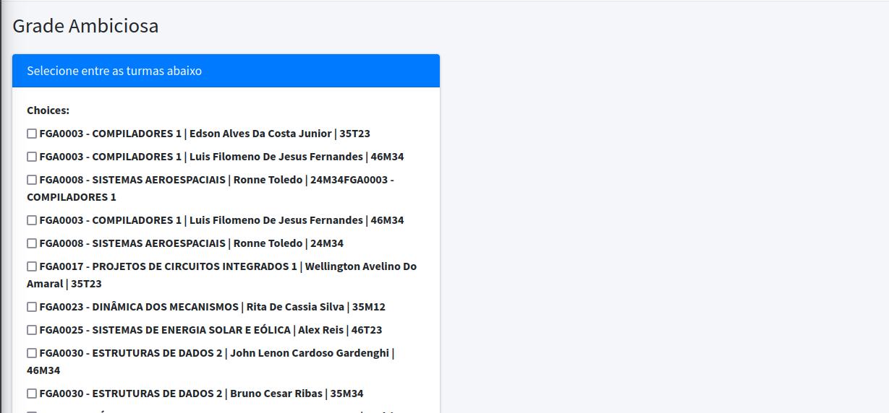
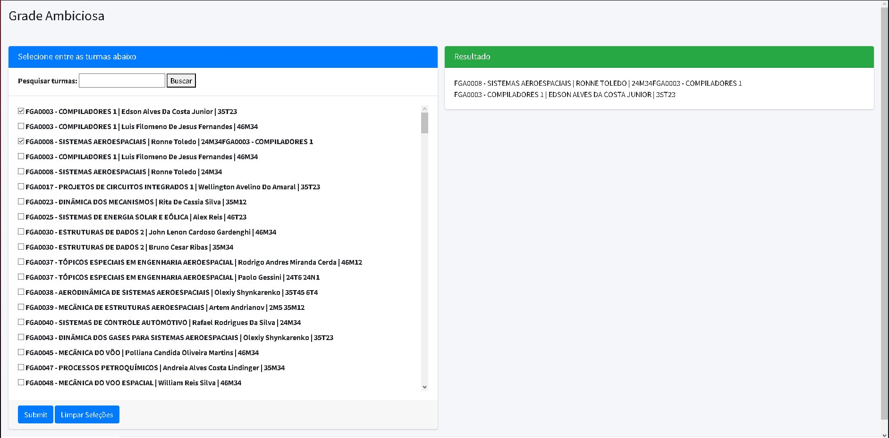

# Greed_GradeAmbiciosa

>"*Greed is good. Greed is right. Greed works. Greed clarifies, cuts through, and captures the essence of the evolutionary spirit.*" - Gordon Gecko (Michael Douglas)

**Conteúdo da Disciplina**: Greed 

## Alunos
|Matrícula | Aluno |
| -- | -- |
| 21/1029620 | Douglas Alves dos Santos |
| 21/1039297 | Bruno Martins Valério Bomfim |

## Sobre 
**Grade Ambiciosa** é um projeto desenvolvido em python para o módulo de Algoritmos Ambiciosos, cujo propósito é realizar um webscraping da disponibilização de turmas no SIGAA e seus horários para montar uma grade otimizada, *i.e.*, que maximize o número de matérias cursadas em um semestre com base no algoritmo **Interval Scheduling**.

## Screenshots
### Tela inicial

Imagem 1: Tela inicial do site (Fonte: autores, 2023).

### Tela de resultado

Imagem 2: Tela de resultado da grade (Fonte: autores, 2023).

## Instalação 

**Linguagens e frameworks**: 

  

Para executar este jogo localmente, certifique-se que você possui o Python (>= 3.10.12) instalado em sua máquina. Caso não possua, você pode baixá-lo [no site oficial](https://www.python.org/downloads/).

É necessário também ter o gerenciador de pacotes pip (>= 22.0.2) instalado. Caso não possua, você pode baixá-lo [aqui](https://pypi.org/project/pip/).

*Grade Ambiciosa* foi desenvolvida com base no framework [django](https://www.djangoproject.com/). Para instalá-lo, execute o seguinte comando no terminal:

    pip install django==4.2.6

Em seguida, clone o repositório com o comando

    git clone git@github.com:projeto-de-algoritmos/Greed_GradeAmbiciosa.git
## Uso 
Depois de haver instalado as dependências necessárias e clonado o repositório na sua máquina local, a partir da raiz da repositório, execute o comando
    python3 manage.py runserver

Após isto, utilize seu navegador de preferência para acessar o servidor local disponível no endereço `http://127.0.0.1:8000/`.

## Apresentação
Para a explicação dos principais algoritmos utilizados e da estrutura do projeto, gravamos um vídeo explicativo em formato .mp4, o qual deve ser baixado para ser assistido.

Acesse o vídeo [aqui](assets/apresentacao.mp4)

## Créditos
Os algoritmos empregados para a realização do [webscraping](webscraper.ipynb) são uma adaptação do repositório [2022-2-QuantiFGA](https://github.com/fga-eps-mds/2022-2-QuantiFGA), da disciplina de MDS.